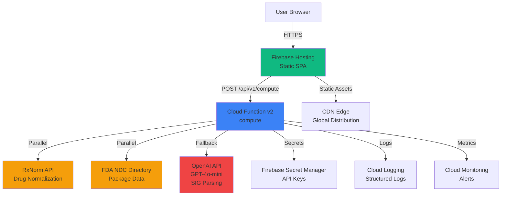
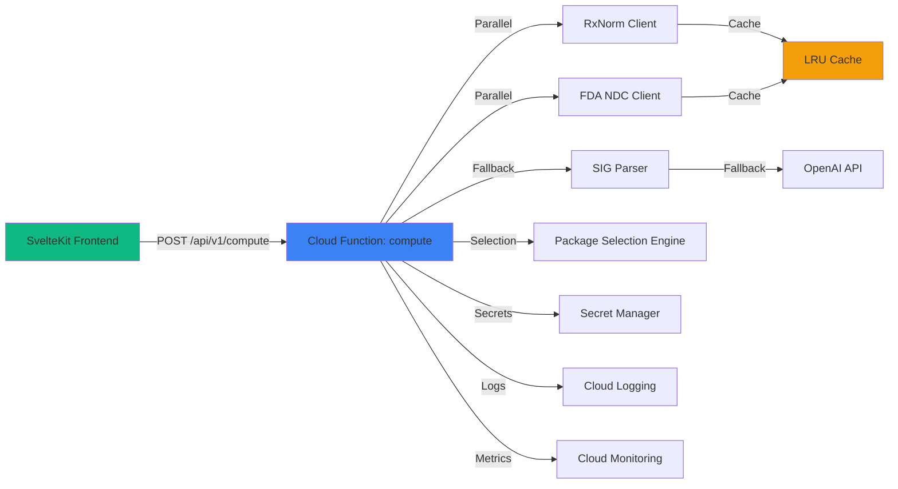
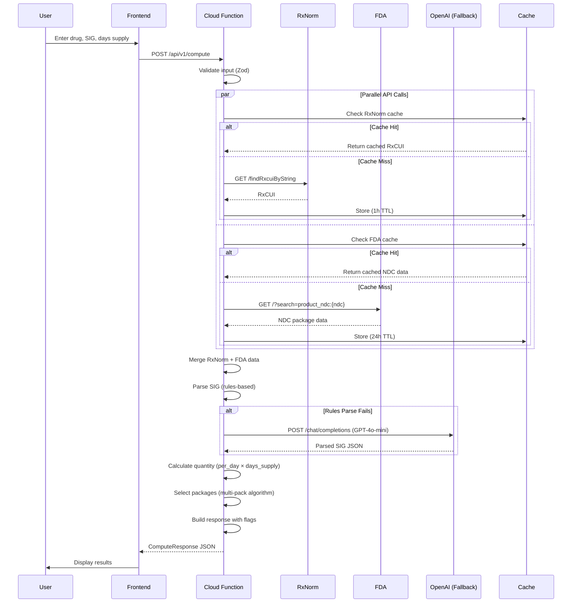
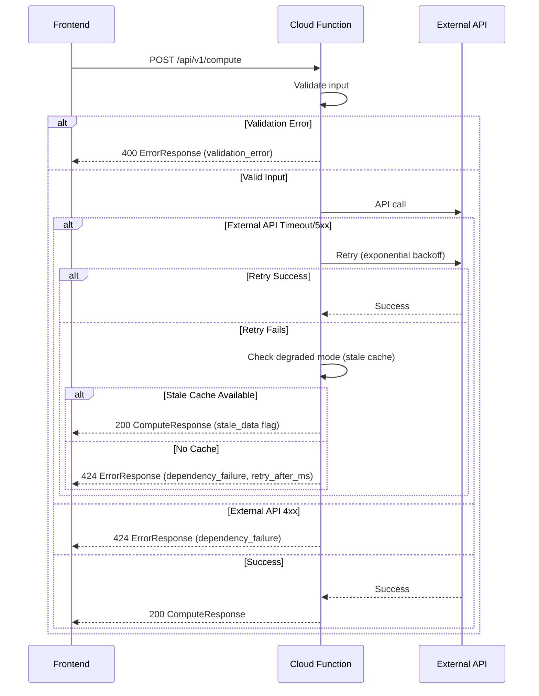

# NDC Packaging & Quantity Calculator — Architecture Document

> **Version**: 1.0  
> **Date**: 2024  
> **Based on**: PRD v0.1

---

## 1) Introduction

This document outlines the overall project architecture for the NDC Packaging & Quantity Calculator, including backend systems, frontend implementation, and their integration. Its primary goal is to serve as the guiding architectural blueprint for AI-driven development, ensuring consistency and adherence to chosen patterns and technologies.

**Relationship to Frontend Specification:**
This architecture document works in conjunction with `docs/front-end-spec.md`, which details the frontend-specific design, UI components, and user experience patterns. Core technology stack choices documented herein are definitive for the entire project, including frontend components.

### Starter Template or Existing Project

**Decision**: Greenfield project using standard scaffolding tools:
- SvelteKit project initialized via `npm create svelte@latest`
- Firebase project initialized via `firebase init`
- No existing codebase or starter template dependencies

### Change Log

| Date | Version | Description | Author |
|------|---------|-------------|--------|
| 2024 | 1.0 | Initial architecture document extracted from PRD | Product Owner |

---

## 2) High Level Architecture

### 2.1 Technical Summary

The NDC Packaging & Quantity Calculator is a serverless fullstack application built on Firebase, implementing a Jamstack architecture with static frontend hosting and serverless backend functions. The system uses SvelteKit for the frontend (statically built) and Firebase Cloud Functions (v2) for the backend API. The architecture emphasizes fast, deterministic computation with external API integrations (RxNorm and FDA NDC Directory) for drug normalization and package data retrieval. The system implements a hybrid SIG parsing approach (rules-based with AI fallback) and uses in-memory caching to optimize performance. This architecture supports the PRD goals of fast computation (p95 ≤ 2s), zero PHI persistence, and easy embedding via a simple API.

### 2.2 High Level Overview

**Architectural Style**: Serverless (Jamstack)
- **Frontend**: Static SPA served via Firebase Hosting
- **Backend**: Serverless Cloud Functions (v2)
- **Repository Structure**: Monorepo (single repository for frontend and backend)
- **Service Architecture**: Single API service (monolithic function for MVP)

**Primary User Interaction Flow**:
1. User enters drug input, SIG, and days supply in web UI
2. Frontend sends POST request to `/api/v1/compute` Cloud Function
3. Cloud Function normalizes drug to RxCUI (RxNorm API)
4. Cloud Function retrieves NDC data (FDA API) - executed in parallel with RxNorm
5. Cloud Function parses SIG (rules-based, with AI fallback if needed)
6. Cloud Function calculates quantity and selects optimal package
7. Cloud Function returns structured JSON response
8. Frontend displays results with flags, alternates, and warnings

**Key Architectural Decisions**:
- **Serverless**: Cost-effective, auto-scaling, no server management
- **Static Frontend**: Fast loading, CDN distribution, simple deployment
- **In-Memory Caching**: No database for MVP, reduces external API calls
- **Parallel API Execution**: RxNorm and FDA calls run concurrently for performance
- **Hybrid SIG Parsing**: Rules-based primary (fast) with AI fallback (accurate)

### 2.3 High Level Architecture Diagram



### 2.4 Architectural Patterns

- **Serverless Architecture**: Using Firebase Cloud Functions (v2) for backend compute - _Rationale_: Aligns with PRD requirement for cost optimization, automatic scaling, and zero server management
- **Jamstack Pattern**: Static frontend with serverless APIs - _Rationale_: Optimal performance, CDN distribution, and simple deployment workflow
- **Repository Pattern**: Abstract data access for external APIs - _Rationale_: Enables testing, caching, and future database migration flexibility
- **Hybrid Processing Pattern**: Rules-based primary with AI fallback - _Rationale_: Balances speed (rules) with accuracy (AI) for SIG parsing
- **Parallel Execution Pattern**: Concurrent external API calls - _Rationale_: Reduces latency by eliminating sequential dependencies
- **In-Memory Caching Pattern**: LRU cache per function instance - _Rationale_: Reduces external API calls and improves response time without database complexity

---

## 3) Tech Stack

### 3.1 Cloud Infrastructure

- **Provider**: Google Cloud Platform (via Firebase)
- **Key Services**: 
  - Firebase Hosting (static site hosting)
  - Firebase Cloud Functions v2 (serverless compute)
  - Firebase Secret Manager (secrets management)
  - Cloud Logging (structured logging)
  - Cloud Monitoring (metrics and alerts)
- **Deployment Regions**: `us-central1` (Cloud Functions), Global (Firebase Hosting CDN)

### 3.2 Technology Stack Table

| Category | Technology | Version | Purpose | Rationale |
|----------|-----------|---------|---------|------------|
| **Frontend Language** | TypeScript | Latest stable | Type-safe frontend development | Strong typing, excellent tooling, team expertise |
| **Frontend Framework** | SvelteKit | Latest stable | Frontend framework and routing | Modern, performant, excellent DX, built-in routing |
| **Frontend Build Tool** | Vite | Latest (default with SvelteKit) | Fast dev server, optimized builds | Fast HMR, optimized production builds using Rollup |
| **Frontend Adapter** | @sveltejs/adapter-static | Latest | Static site generation | Required for Firebase Hosting static deployment |
| **Backend Language** | TypeScript | Latest stable | Type-safe backend development | Consistency with frontend, strong typing |
| **Backend Runtime** | Node.js | 20 | JavaScript runtime | LTS version, stable performance, Firebase Functions v2 requirement |
| **Backend Framework** | Firebase Cloud Functions v2 | Latest | Serverless compute | Auto-scaling, cost-effective, integrated with Firebase ecosystem |
| **API Style** | REST | v1 | API communication | Simple, well-understood, easy to integrate |
| **Validation Library** | Zod | Latest | Runtime type validation | Type-safe validation, excellent TypeScript integration |
| **HTTP Client (Frontend)** | Axios | Latest | API requests from frontend | Reliable, interceptors, good error handling |
| **HTTP Client (Backend)** | Axios | Latest | External API calls | Consistent with frontend, reliable |
| **AI Integration** | OpenAI SDK | Latest | SIG parsing fallback | Official SDK, well-maintained, GPT-4o-mini support |
| **Caching** | lru-cache | Latest | In-memory LRU cache | Lightweight, efficient, per-instance caching |
| **Secrets Management** | Firebase Secret Manager | Latest | API keys and secrets | Secure, integrated with Cloud Functions |
| **Logging** | Cloud Logging | Native | Structured logging | Integrated with Firebase, JSON format |
| **Monitoring** | Cloud Monitoring | Native | Metrics and alerts | Integrated with Firebase, default alerts |
| **CI/CD** | Manual (firebase deploy) | - | Deployment | MVP simplicity, automation deferred to v1.1 |
| **Testing Framework** | TBD | - | Unit and integration tests | To be determined during Epic 1 |

---

## 4) Data Models

### 4.1 ComputeRequest

**Purpose**: Request payload for the compute API endpoint

**Key Attributes**:
- `drug_input`: `string` - Drug name (brand/generic) or NDC format (11 digits)
- `sig`: `string` - Prescription directions (free text)
- `days_supply`: `number` - Days of medication supply (1-365)
- `preferred_ndcs`: `string[]` (optional) - Array of preferred NDCs for ranking bias
- `quantity_unit_override`: `'tab'|'cap'|'mL'|'actuation'|'unit'` (optional) - Override unit type

**TypeScript Interface**:
```typescript
export type ComputeRequest = {
  drug_input: string;
  sig: string;
  days_supply: number;
  preferred_ndcs?: string[];
  quantity_unit_override?: 'tab'|'cap'|'mL'|'actuation'|'unit';
};
```

**Relationships**: None (input model)

### 4.2 ComputeResponse

**Purpose**: Response payload from the compute API endpoint

**Key Attributes**:
- `rxnorm`: `{ rxcui: string; name: string }` - Normalized RxNorm data
- `computed`: `{ dose_unit: string; per_day: number; total_qty: number; days_supply: number }` - Calculated quantities
- `ndc_selection`: Object containing chosen package and alternates
  - `chosen`: `{ ndc: string; pkg_size: number; active: boolean; overfill: number; packs: number }` (optional)
  - `alternates`: Array of alternate package options
- `flags`: `{ inactive_ndcs: string[]; mismatch: boolean; notes?: string[]; error_code?: string | null }` - Warnings and status flags

**TypeScript Interface**:
```typescript
export type ComputeResponse = {
  rxnorm: { rxcui: string; name: string };
  computed: { dose_unit: string; per_day: number; total_qty: number; days_supply: number };
  ndc_selection: {
    chosen?: { ndc: string; pkg_size: number; active: boolean; overfill: number; packs: number };
    alternates: { ndc: string; pkg_size: number; active: boolean; overfill: number; packs: number }[];
  };
  flags: { inactive_ndcs: string[]; mismatch: boolean; notes?: string[]; error_code?: string | null };
};
```

**Relationships**: None (output model)

### 4.3 ErrorResponse

**Purpose**: Standardized error response format

**Key Attributes**:
- `error`: `string` - Human-readable error message
- `error_code`: `'validation_error' | 'parse_error' | 'dependency_failure' | 'internal_error' | 'rate_limit_exceeded'` - Machine-readable error code
- `detail`: `string` (optional) - Additional context or guidance
- `retry_after_ms`: `number` (optional) - Retry delay in milliseconds (for 424 errors)
- `field_errors`: `Array<{ field: string; message: string }>` (optional) - Field-level validation errors

**TypeScript Interface**:
```typescript
export type ErrorResponse = {
  error: string;
  error_code: 'validation_error' | 'parse_error' | 'dependency_failure' | 'internal_error' | 'rate_limit_exceeded';
  detail?: string;
  retry_after_ms?: number;
  field_errors?: Array<{ field: string; message: string }>;
};
```

**Relationships**: None (error model)

---

## 5) Components

### 5.1 Frontend Application (SvelteKit SPA)

**Responsibility**: User interface for drug input, SIG entry, days supply, and results display

**Key Interfaces**:
- User input form (drug_input, sig, days_supply)
- Advanced options accordion (preferred_ndcs, unit_override, max_overfill)
- Results display (quantity, chosen NDC, alternates, flags)
- Toast notification system
- Copy JSON functionality

**Dependencies**: 
- Cloud Function API (`/api/v1/compute`)
- Design system (colors, typography, spacing from front-end-spec.md)

**Technology Stack**: SvelteKit, TypeScript, Vite, @sveltejs/adapter-static

### 5.2 Cloud Function: compute

**Responsibility**: Core computation engine - drug normalization, NDC retrieval, SIG parsing, quantity calculation, package selection

**Key Interfaces**:
- `POST /api/v1/compute` - Main API endpoint
- Internal functions:
  - `normalizeDrug()` - RxNorm integration
  - `fetchNDCData()` - FDA API integration
  - `parseSIG()` - Rules-based + AI fallback parsing
  - `calculateQuantity()` - Quantity computation
  - `selectPackages()` - Multi-pack selection algorithm

**Dependencies**: 
- RxNorm API (external)
- FDA NDC Directory API (external)
- OpenAI API (external, fallback only)
- Firebase Secret Manager (secrets)
- LRU cache (in-memory)

**Technology Stack**: Firebase Cloud Functions v2, Node.js 20, TypeScript, Axios, Zod, OpenAI SDK, lru-cache

### 5.3 RxNorm Client

**Responsibility**: Drug name/NDC normalization to RxCUI

**Key Interfaces**:
- `findRxcuiByString(name: string): Promise<string>` - Name to RxCUI
- `getNdcsByRxcui(rxcui: string): Promise<string[]>` - RxCUI to NDCs
- `approximateTerm(term: string): Promise<string | null>` - Approximate matching fallback

**Dependencies**: RxNorm REST API, LRU cache

**Technology Stack**: Axios, lru-cache

### 5.4 FDA NDC Client

**Responsibility**: NDC package data retrieval (status, package sizes, dosage form)

**Key Interfaces**:
- `lookupByNDC(ndc: string): Promise<NDCPackageData>` - NDC lookup
- `searchByBrandName(name: string): Promise<NDCPackageData[]>` - Brand name search

**Dependencies**: openFDA API, LRU cache

**Technology Stack**: Axios, lru-cache

### 5.5 SIG Parser

**Responsibility**: Parse prescription SIG text into structured per-day consumption data

**Key Interfaces**:
- `parseSIG(sig: string): Promise<ParsedSIG | null>` - Main parsing function
- `parseWithRules(sig: string): ParsedSIG | null` - Rules-based parsing
- `parseWithAI(sig: string): Promise<ParsedSIG | null>` - AI fallback parsing

**Dependencies**: OpenAI API (fallback only), feature flag `USE_AI_FALLBACK`

**Technology Stack**: Regex patterns, OpenAI SDK (GPT-4o-mini)

### 5.6 Package Selection Engine

**Responsibility**: Select optimal package combination based on quantity and ranking rules

**Key Interfaces**:
- `selectPackages(ndcs: NDCPackageData[], totalQty: number, config: SelectionConfig): PackageSelection` - Main selection function

**Dependencies**: NDC data from FDA client

**Technology Stack**: TypeScript algorithms

### 5.7 Component Diagram



---

## 6) External APIs

### 6.1 RxNorm API

- **Purpose**: Drug name normalization to RxCUI and NDC↔RxCUI crosswalk
- **Documentation**: https://rxnav.nlm.nih.gov/RESTful.html
- **Base URL(s)**: `https://rxnav.nlm.nih.gov/REST/`
- **Authentication**: None required (public API)
- **Rate Limits**: 10 req/sec per function instance (conservative limit)

**Key Endpoints Used**:
- `GET /findRxcuiByString?name={drug_name}` - Name to RxCUI normalization
- `GET /rxcui/{rxcui}/ndcs` - RxCUI to NDC mapping
- `GET /approximateTerm?term={drug_name}` - Approximate matching (fallback)

**Integration Notes**: 
- Do NOT use for NDC activity status (FDA is source of truth)
- Cache responses for 1 hour TTL (in-memory LRU cache)
- Retry on 5xx errors and timeouts (max 1 retry, exponential backoff)
- Timeout: 5 seconds per request

### 6.2 FDA NDC Directory API (openFDA)

- **Purpose**: Authoritative source for NDC activity status, package sizes, and marketing status
- **Documentation**: https://open.fda.gov/apis/drug/ndc/
- **Base URL(s)**: `https://api.fda.gov/drug/ndc.json`
- **Authentication**: None required (public API)
- **Rate Limits**: 3 req/sec per instance (openFDA limit: 240/min)

**Key Endpoints Used**:
- `GET /?search=product_ndc:{ndc}` - Lookup by NDC
- `GET /?search=brand_name:{name}` - Search by brand name

**Integration Notes**: 
- Source of truth for NDC activity status and package metadata
- If FDA and RxNorm disagree, trust FDA for status/packaging
- Cache responses for 24 hours TTL (in-memory LRU cache)
- Retry on 5xx errors and timeouts (max 1 retry, exponential backoff)
- Timeout: 5 seconds per request

### 6.3 OpenAI API

- **Purpose**: AI fallback for SIG parsing when rules-based parser fails
- **Documentation**: https://platform.openai.com/docs/api-reference
- **Base URL(s)**: `https://api.openai.com/v1/`
- **Authentication**: API key via Firebase Secret Manager (`OPENAI_API_KEY`)
- **Rate Limits**: OpenAI tier limits (sufficient for MVP fallback usage)

**Key Endpoints Used**:
- `POST /chat/completions` - GPT-4o-mini for SIG parsing

**Integration Notes**: 
- Feature flag `USE_AI_FALLBACK` (default: true for MVP)
- Only called when rules-based parser fails
- Expected fallback rate: ~10% of requests
- Cost: ~$0.00001 per request average
- Retry on 5xx errors and timeouts (max 1 retry, exponential backoff)
- Timeout: 5 seconds per request

---

## 7) Core Workflows

### 7.1 Main Computation Workflow



### 7.2 Error Handling Workflow



---

## 8) API Specification

### 8.1 REST API Endpoint

**Endpoint**: `POST /api/v1/compute`

**Request Schema** (from Data Models §4.1):
```typescript
{
  drug_input: string;           // Required, 2-200 chars, drug name or NDC
  sig: string;                  // Required, 3-500 chars, prescription directions
  days_supply: number;          // Required, 1-365, integer
  preferred_ndcs?: string[];    // Optional, max 10 NDCs, valid NDC format
  quantity_unit_override?: 'tab'|'cap'|'mL'|'actuation'|'unit';  // Optional
}
```

**Response Schema** (from Data Models §4.2):
```typescript
{
  rxnorm: { rxcui: string; name: string };
  computed: { dose_unit: string; per_day: number; total_qty: number; days_supply: number };
  ndc_selection: {
    chosen?: { ndc: string; pkg_size: number; active: boolean; overfill: number; packs: number };
    alternates: Array<{ ndc: string; pkg_size: number; active: boolean; overfill: number; packs: number }>;
  };
  flags: { inactive_ndcs: string[]; mismatch: boolean; notes?: string[]; error_code?: string | null };
}
```

**Error Response Schema** (from Data Models §4.3):
- `400` - Invalid input (`validation_error`)
- `422` - Unparseable SIG (`parse_error`)
- `424` - Dependency failure (`dependency_failure`) - includes `retry_after_ms`
- `429` - Rate limit exceeded (`rate_limit_exceeded`)
- `500` - Internal error (`internal_error`)

**Authentication**: Optional API key via `Authorization: Bearer <API_KEY>` header (configurable per environment)

**CORS**: 
- Production: Firebase Hosting origin only
- Development: localhost allowed

**Rate Limiting**: Per-IP rate limiting (10 requests per minute) - MVP implementation

---

## 9) Database Schema

**MVP Decision**: No persistent database for MVP. All data is:
- Ephemeral (request/response only)
- Cached in-memory (LRU cache per function instance)
- Not persisted to disk

**Future Consideration**: If database is needed in v1.1+, consider Firestore for:
- Preferred NDC lists
- Formulary data
- Usage analytics (non-PHI)

---

## 10) Source Tree

```
ndc-qty/
├── .github/                    # CI/CD workflows (v1.1)
├── docs/                       # Documentation
│   ├── PRD.md
│   ├── front-end-spec.md
│   ├── architecture.md
│   └── reference/
├── functions/                  # Firebase Cloud Functions
│   ├── src/
│   │   ├── index.ts            # Function entry point
│   │   ├── handlers/
│   │   │   └── compute.ts      # Main compute handler
│   │   ├── services/
│   │   │   ├── rxnorm-client.ts
│   │   │   ├── fda-client.ts
│   │   │   ├── sig-parser.ts
│   │   │   └── package-selector.ts
│   │   ├── utils/
│   │   │   ├── cache.ts        # LRU cache wrapper
│   │   │   ├── logger.ts      # Structured logging
│   │   │   └── errors.ts       # Error handling
│   │   ├── types/
│   │   │   └── index.ts        # TypeScript types
│   │   └── validation/
│   │       └── schemas.ts      # Zod schemas
│   ├── tests/                  # Backend tests
│   ├── package.json
│   └── tsconfig.json
├── src/                        # SvelteKit frontend
│   ├── lib/
│   │   ├── components/         # UI components
│   │   │   ├── Header.svelte
│   │   │   ├── InputForm.svelte
│   │   │   ├── ResultsCard.svelte
│   │   │   ├── Toast.svelte
│   │   │   ├── Button.svelte
│   │   │   ├── Input.svelte
│   │   │   ├── Badge.svelte
│   │   │   └── Card.svelte
│   │   ├── services/
│   │   │   └── api.ts           # API client
│   │   ├── stores/              # State management
│   │   │   └── results.ts
│   │   └── utils/
│   │       └── validation.ts
│   ├── routes/
│   │   └── +page.svelte        # Main page
│   ├── app.html
│   └── app.d.ts
├── public/                     # Static assets
├── tests/                      # Frontend tests
├── .env.example
├── firebase.json               # Firebase config
├── firebase.json               # Firebase config
├── svelte.config.js            # SvelteKit config
├── package.json                # Root package.json
├── tsconfig.json
├── vite.config.ts
└── README.md
```

---

## 11) Infrastructure and Deployment

### 11.1 Infrastructure as Code

- **Tool**: Firebase CLI (declarative configuration)
- **Location**: `firebase.json`, `firebase.json` (Firebase config files)
- **Approach**: Firebase-native configuration (no Terraform/Pulumi for MVP)

### 11.2 Deployment Strategy

- **Strategy**: Manual deployment via `firebase deploy` (MVP)
- **CI/CD Platform**: Manual (automation deferred to v1.1)
- **Pipeline Configuration**: N/A for MVP

### 11.3 Environments

- **Development**: `{project-id}-dev` Firebase project
  - Local development with Firebase emulators
  - Mock APIs for RxNorm/FDA during development
- **Production**: `{project-id}` Firebase project
  - Firebase Hosting (static frontend)
  - Cloud Functions v2 (us-central1)
  - Production secrets in Secret Manager

### 11.4 Environment Promotion Flow

```
Local Development (Emulators)
    ↓
Development Firebase Project (Manual Deploy)
    ↓
Production Firebase Project (Manual Deploy)
```

### 11.5 Rollback Strategy

- **Primary Method**: Firebase Hosting version rollback + Cloud Function version rollback
- **Trigger Conditions**: Critical errors, performance degradation, security issues
- **Recovery Time Objective**: < 5 minutes (manual rollback)

---

## 12) Error Handling Strategy

### 12.1 General Approach

- **Error Model**: Structured error responses with `error_code` and `detail` fields
- **Exception Hierarchy**: Custom error classes extending base `AppError` with error codes
- **Error Propagation**: Errors caught at handler level, translated to `ErrorResponse` format

### 12.2 Logging Standards

- **Library**: Cloud Logging (native Firebase)
- **Format**: Structured JSON logs
- **Levels**: `info`, `warn`, `error`
- **Required Context**:
  - Correlation ID: Request ID (generated per request)
  - Service Context: Function name, region
  - User Context: Redacted (no PHI in logs)

**Log Redaction Rules**:
- Redact `drug_input` and `sig` from logs (replace with `[REDACTED]` or boolean flag)
- Keep `days_supply`, `error_code`, `rxcui`, `ndc` (not PHI)
- Never log full request/response bodies containing SIG text

### 12.3 Error Handling Patterns

#### External API Errors

- **Retry Policy**: Max 1 retry, exponential backoff (1000ms, 2000ms max)
- **Circuit Breaker**: None for MVP (deferred to v1.1)
- **Timeout Configuration**: 5 seconds per upstream request, 10 seconds total function budget
- **Error Translation**: Map external API errors to `ErrorResponse` format with appropriate `error_code`

#### Business Logic Errors

- **Custom Exceptions**: 
  - `ValidationError` → `400` with `validation_error` code
  - `ParseError` → `422` with `parse_error` code
  - `DependencyError` → `424` with `dependency_failure` code
- **User-Facing Errors**: Clear, actionable error messages in `error` and `detail` fields
- **Error Codes**: Deterministic codes for programmatic handling

#### Data Consistency

- **Transaction Strategy**: N/A (no database for MVP)
- **Compensation Logic**: Degraded mode with stale cache (48 hours max)
- **Idempotency**: N/A for MVP (stateless compute function)

---

## 13) Security

### 13.1 Input Validation

- **Validation Library**: Zod
- **Validation Location**: API boundary (Cloud Function handler)
- **Required Rules**:
  - All external inputs MUST be validated before processing
  - Validation at API boundary before any business logic
  - Whitelist approach preferred over blacklist

### 13.2 Authentication & Authorization

- **Auth Method**: Optional API key authentication (configurable per environment)
- **Session Management**: Stateless (no sessions)
- **Required Patterns**:
  - API key via `Authorization: Bearer <API_KEY>` header
  - API key stored in Firebase Secret Manager
  - CORS policy restricts origins (Firebase Hosting in prod, localhost in dev)

### 13.3 Secrets Management

- **Development**: `.env` file (not committed) or Firebase emulator config
- **Production**: Firebase Secret Manager
- **Code Requirements**:
  - NEVER hardcode secrets
  - Access via `defineSecret()` from `firebase-functions/params`
  - No secrets in logs or error messages

**Required Secrets**:
- `OPENAI_API_KEY` - OpenAI API key for SIG parsing fallback
- `API_KEY` - Optional API key for authentication

### 13.4 API Security

- **Rate Limiting**: Per-IP rate limiting (10 req/min) - in-memory Map per instance
- **CORS Policy**: 
  - Production: Firebase Hosting origin only
  - Development: localhost allowed
- **Security Headers**: Firebase Hosting default headers (HTTPS enforcement)
- **HTTPS Enforcement**: Firebase Hosting enforces HTTPS (TLS 1.2+)

### 13.5 Data Protection

- **Encryption at Rest**: N/A (no persistent storage for MVP)
- **Encryption in Transit**: HTTPS/TLS everywhere (Firebase default)
- **PII Handling**: 
  - No PHI persistence
  - Redact `drug_input` and `sig` from logs
  - Ephemeral processing only
- **Logging Restrictions**: Never log full request/response bodies with SIG text

### 13.6 Dependency Security

- **Scanning Tool**: `npm audit` (manual for MVP)
- **Update Policy**: Regular dependency updates, security patches immediately
- **Approval Process**: Review and test before updating dependencies

### 13.7 Security Testing

- **SAST Tool**: ESLint security plugins (manual for MVP)
- **DAST Tool**: Manual testing for MVP
- **Penetration Testing**: Manual security review before production

---

## 14) Coding Standards

### 14.1 Core Standards

- **Languages & Runtimes**: TypeScript (latest stable), Node.js 20
- **Style & Linting**: ESLint + Prettier (to be configured in Epic 1)
- **Test Organization**: Tests co-located with source files (`*.test.ts`)

### 14.2 Critical Rules

- **Type Safety**: Always use TypeScript types, never `any` without justification
- **Error Handling**: All API routes must use standard `ErrorResponse` format
- **Logging**: Never use `console.log` in production - use structured logger
- **Secrets**: Never hardcode secrets - use Firebase Secret Manager
- **PHI Redaction**: Always redact `drug_input` and `sig` from logs
- **API Calls**: Use Axios with proper error handling and timeouts
- **Validation**: Validate all inputs at API boundary using Zod schemas
- **Caching**: Use LRU cache wrapper, never direct cache access in business logic

---

## 15) Test Strategy and Standards

### 15.1 Testing Philosophy

- **Approach**: Test-after development (TDD deferred to v1.1)
- **Coverage Goals**: 
  - Unit tests: Core algorithms (SIG parser, package selector)
  - Integration tests: API endpoint with emulators
  - E2E tests: Critical user flows (deferred to v1.1)
- **Test Pyramid**: Focus on unit and integration tests for MVP

### 15.2 Test Types and Organization

#### Unit Tests

- **Framework**: TBD (Jest or Vitest recommended)
- **File Convention**: `*.test.ts` co-located with source
- **Location**: `functions/src/**/*.test.ts`, `src/**/*.test.ts`
- **Mocking Library**: TBD (Jest mocks or Vitest mocks)
- **Coverage Requirement**: Core algorithms (SIG parser, package selector) - 80%+

**AI Agent Requirements**:
- Generate tests for all public methods
- Cover edge cases and error conditions
- Follow AAA pattern (Arrange, Act, Assert)
- Mock all external dependencies (RxNorm, FDA, OpenAI)

#### Integration Tests

- **Scope**: API endpoint with Firebase emulators
- **Location**: `functions/tests/integration/`
- **Test Infrastructure**:
  - **Firebase Emulators**: Functions + Hosting emulators for local testing
  - **Mock APIs**: Express server for RxNorm/FDA during integration tests

#### E2E Tests

- **Framework**: TBD (Playwright or Cypress recommended)
- **Scope**: Critical user flows (deferred to v1.1)
- **Environment**: Staging environment
- **Test Data**: Synthetic test data (no real PHI)

### 15.3 Test Data Management

- **Strategy**: Synthetic test data, fixtures for common scenarios
- **Fixtures**: `tests/fixtures/` directory
- **Factories**: Test data factories for generating test cases
- **Cleanup**: Stateless tests (no cleanup needed for MVP)

### 15.4 Continuous Testing

- **CI Integration**: Manual testing for MVP (automation deferred to v1.1)
- **Performance Tests**: Manual performance testing (p95 latency validation)
- **Security Tests**: Manual security review before production

---

## 16) Monitoring and Observability

### 16.1 Monitoring Stack

- **Frontend Monitoring**: Optional `gtag` for page views and compute events (no PHI)
- **Backend Monitoring**: Cloud Monitoring (native Firebase)
- **Error Tracking**: Cloud Logging with structured JSON logs
- **Performance Monitoring**: Cloud Monitoring metrics (latency, error rate)

### 16.2 Key Metrics

**Backend Metrics** (required for MVP):
- Request rate
- Error rate (p50/p95)
- Latency (p50/p95) - target: p95 ≤ 2s
- Parse-fail rate
- Inactive-only rate
- Overfill occurrences
- Selected-pack count

**Frontend Metrics** (optional for MVP):
- Page load time
- API response time
- JavaScript errors

### 16.3 Alert Thresholds

- **Uptime**: Alert if error rate > 5% over 5 minutes
- **Latency**: Alert if p95 > 3 seconds over 5 minutes
- **Implementation**: Cloud Monitoring default alerts (no custom dashboard for MVP)

### 16.4 Logging

- **Sampling**: 10% in production, 100% in staging
- **Retention**: ≤ 30 days
- **Format**: Structured JSON logs
- **PHI**: Redacted (drug_input, sig never logged)

---

## 17) Next Steps

1. **Review with Product Owner**: Validate architecture against PRD requirements
2. **Begin Epic 1 Implementation**: Set up project infrastructure (Story 1.1-1.4)
3. **Create User Stories**: Extract stories from PRD epics for development
4. **Set Up Development Environment**: Initialize SvelteKit project, Firebase project, local emulators

---

**End of Architecture Document**

