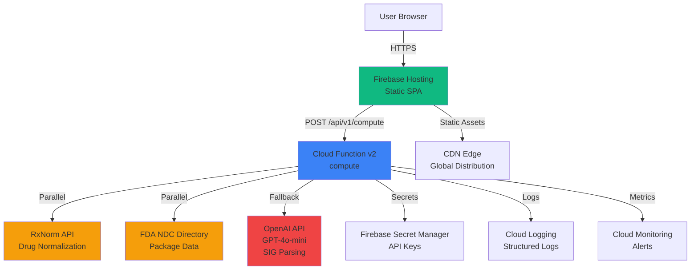

# 2) High Level Architecture

### 2.1 Technical Summary

The NDC Packaging & Quantity Calculator is a serverless fullstack application built on Firebase, implementing a Jamstack architecture with static frontend hosting and serverless backend functions. The system uses SvelteKit for the frontend (statically built) and Firebase Cloud Functions (v2) for the backend API. The architecture emphasizes fast, deterministic computation with external API integrations (RxNorm and FDA NDC Directory) for drug normalization and package data retrieval. The system implements a hybrid SIG parsing approach (rules-based with AI fallback) and uses in-memory caching to optimize performance. This architecture supports the PRD goals of fast computation (p95 ≤ 2s), zero PHI persistence, and easy embedding via a simple API.

### 2.2 High Level Overview

**Architectural Style**: Serverless (Jamstack)
- **Frontend**: Static SPA served via Firebase Hosting
- **Backend**: Serverless Cloud Functions (v2)
- **Repository Structure**: Monorepo (single repository for frontend and backend)
- **Service Architecture**: Single API service (monolithic function for MVP)

**Primary User Interaction Flow**:
1. User enters drug input, SIG, and days supply in web UI
2. Frontend sends POST request to `/api/v1/compute` Cloud Function
3. Cloud Function normalizes drug to RxCUI (RxNorm API)
4. Cloud Function retrieves NDC data (FDA API) - executed in parallel with RxNorm
5. Cloud Function parses SIG (rules-based, with AI fallback if needed)
6. Cloud Function calculates quantity and selects optimal package
7. Cloud Function returns structured JSON response
8. Frontend displays results with flags, alternates, and warnings

**Key Architectural Decisions**:
- **Serverless**: Cost-effective, auto-scaling, no server management
- **Static Frontend**: Fast loading, CDN distribution, simple deployment
- **In-Memory Caching**: No database for MVP, reduces external API calls
- **Parallel API Execution**: RxNorm and FDA calls run concurrently for performance
- **Hybrid SIG Parsing**: Rules-based primary (fast) with AI fallback (accurate)

### 2.3 High Level Architecture Diagram

### 2.4 Architectural Patterns

- **Serverless Architecture**: Using Firebase Cloud Functions (v2) for backend compute - _Rationale_: Aligns with PRD requirement for cost optimization, automatic scaling, and zero server management
- **Jamstack Pattern**: Static frontend with serverless APIs - _Rationale_: Optimal performance, CDN distribution, and simple deployment workflow
- **Repository Pattern**: Abstract data access for external APIs - _Rationale_: Enables testing, caching, and future database migration flexibility
- **Hybrid Processing Pattern**: Rules-based primary with AI fallback - _Rationale_: Balances speed (rules) with accuracy (AI) for SIG parsing
- **Parallel Execution Pattern**: Concurrent external API calls - _Rationale_: Reduces latency by eliminating sequential dependencies
- **In-Memory Caching Pattern**: LRU cache per function instance - _Rationale_: Reduces external API calls and improves response time without database complexity

---

