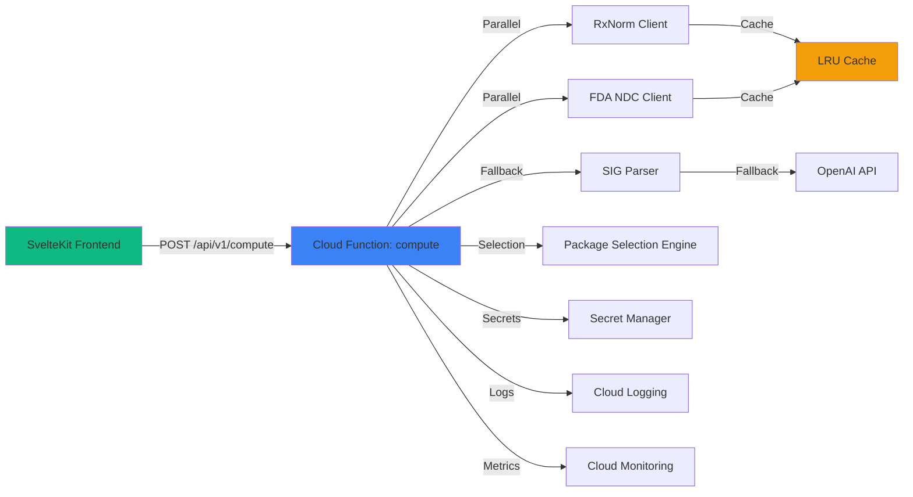

# 5) Components

### 5.1 Frontend Application (SvelteKit SPA)

**Responsibility**: User interface for drug input, SIG entry, days supply, and results display

**Key Interfaces**:
- User input form (drug_input, sig, days_supply)
- Advanced options accordion (preferred_ndcs, unit_override, max_overfill)
- Results display (quantity, chosen NDC, alternates, flags)
- Toast notification system
- Copy JSON functionality

**Dependencies**: 
- Cloud Function API (`/api/v1/compute`)
- Design system (colors, typography, spacing from front-end-spec.md)

**Technology Stack**: SvelteKit, TypeScript, Vite, @sveltejs/adapter-static

### 5.2 Cloud Function: compute

**Responsibility**: Core computation engine - drug normalization, NDC retrieval, SIG parsing, quantity calculation, package selection

**Key Interfaces**:
- `POST /api/v1/compute` - Main API endpoint
- Internal functions:
  - `normalizeDrug()` - RxNorm integration
  - `fetchNDCData()` - FDA API integration
  - `parseSIG()` - Rules-based + AI fallback parsing
  - `calculateQuantity()` - Quantity computation
  - `selectPackages()` - Multi-pack selection algorithm

**Dependencies**: 
- RxNorm API (external)
- FDA NDC Directory API (external)
- OpenAI API (external, fallback only)
- Firebase Secret Manager (secrets)
- LRU cache (in-memory)

**Technology Stack**: Firebase Cloud Functions v2, Node.js 20, TypeScript, Axios, Zod, OpenAI SDK, lru-cache

### 5.3 RxNorm Client

**Responsibility**: Drug name/NDC normalization to RxCUI

**Key Interfaces**:
- `findRxcuiByString(name: string): Promise<string>` - Name to RxCUI
- `getNdcsByRxcui(rxcui: string): Promise<string[]>` - RxCUI to NDCs
- `approximateTerm(term: string): Promise<string | null>` - Approximate matching fallback

**Dependencies**: RxNorm REST API, LRU cache

**Technology Stack**: Axios, lru-cache

### 5.4 FDA NDC Client

**Responsibility**: NDC package data retrieval (status, package sizes, dosage form)

**Key Interfaces**:
- `lookupByNDC(ndc: string): Promise<NDCPackageData>` - NDC lookup
- `searchByBrandName(name: string): Promise<NDCPackageData[]>` - Brand name search

**Dependencies**: openFDA API, LRU cache

**Technology Stack**: Axios, lru-cache

### 5.5 SIG Parser

**Responsibility**: Parse prescription SIG text into structured per-day consumption data

**Key Interfaces**:
- `parseSIG(sig: string): Promise<ParsedSIG | null>` - Main parsing function
- `parseWithRules(sig: string): ParsedSIG | null` - Rules-based parsing
- `parseWithAI(sig: string): Promise<ParsedSIG | null>` - AI fallback parsing

**Dependencies**: OpenAI API (fallback only), feature flag `USE_AI_FALLBACK`

**Technology Stack**: Regex patterns, OpenAI SDK (GPT-4o-mini)

### 5.6 Package Selection Engine

**Responsibility**: Select optimal package combination based on quantity and ranking rules

**Key Interfaces**:
- `selectPackages(ndcs: NDCPackageData[], totalQty: number, config: SelectionConfig): PackageSelection` - Main selection function

**Dependencies**: NDC data from FDA client

**Technology Stack**: TypeScript algorithms

### 5.7 Component Diagram

---

