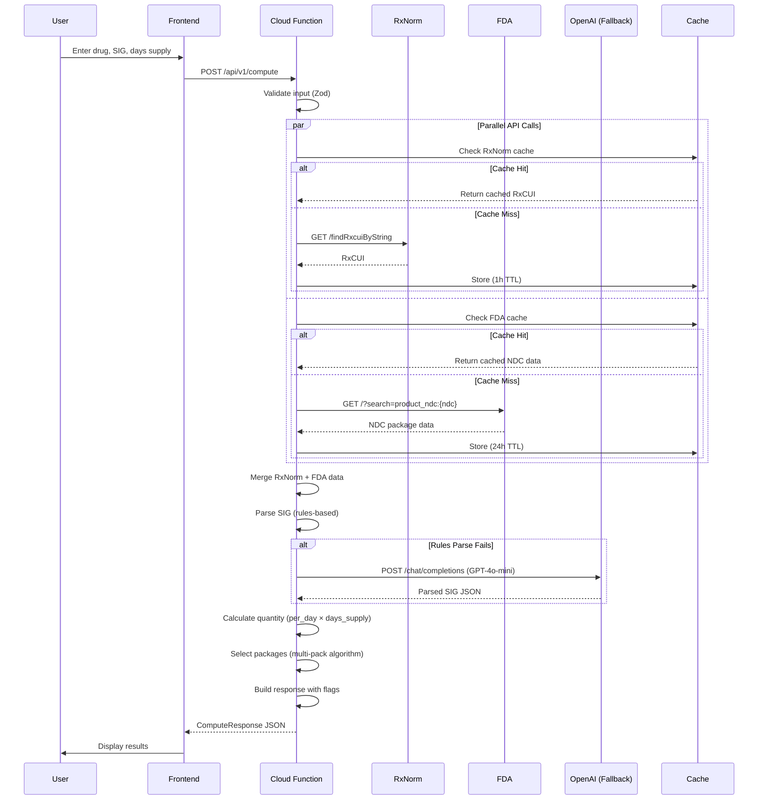
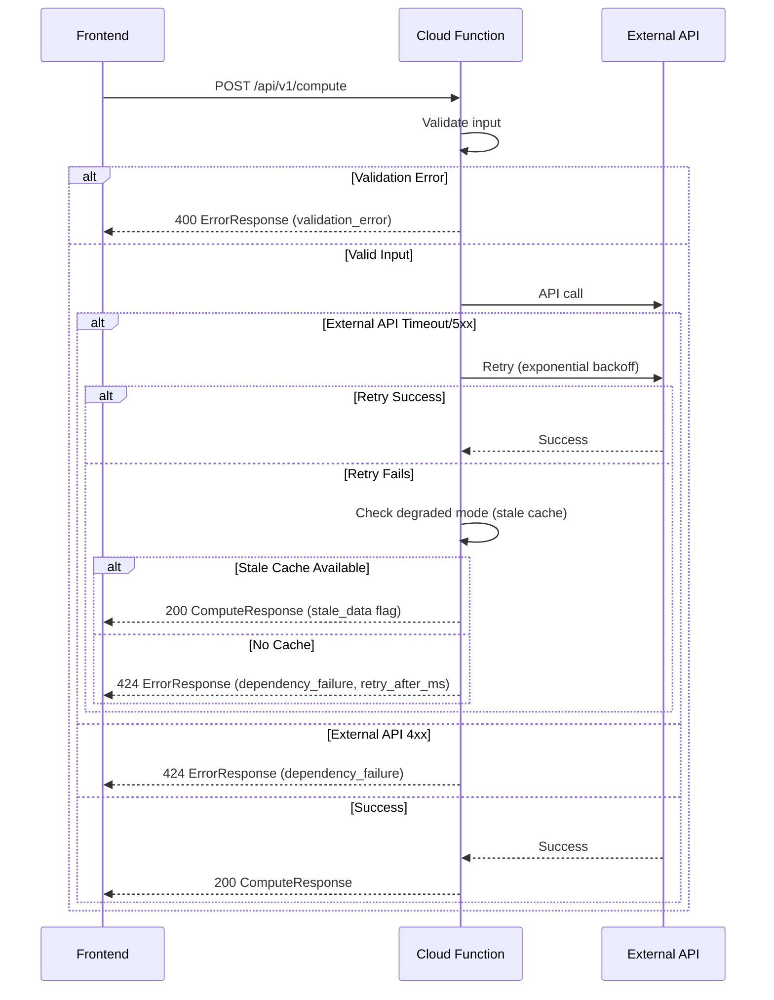

# 7) Core Workflows

### 7.1 Main Computation Workflow

```mermaid
sequenceDiagram
    participant User
    participant Frontend
    participant CF as Cloud Function
    participant RxNorm
    participant FDA
    participant AI as OpenAI (Fallback)
    participant Cache
    
    User->>Frontend: Enter drug, SIG, days supply
    Frontend->>CF: POST /api/v1/compute
    CF->>CF: Validate input (Zod)
    
    par Parallel API Calls
        CF->>Cache: Check RxNorm cache
        alt Cache Hit
            Cache-->>CF: Return cached RxCUI
        else Cache Miss
            CF->>RxNorm: GET /findRxcuiByString
            RxNorm-->>CF: RxCUI
            CF->>Cache: Store (1h TTL)
        end
    and
        CF->>Cache: Check FDA cache
        alt Cache Hit
            Cache-->>CF: Return cached NDC data
        else Cache Miss
            CF->>FDA: GET /?search=product_ndc:{ndc}
            FDA-->>CF: NDC package data
            CF->>Cache: Store (24h TTL)
        end
    end
    
    CF->>CF: Merge RxNorm + FDA data
    CF->>CF: Parse SIG (rules-based)
    
    alt Rules Parse Fails
        CF->>AI: POST /chat/completions (GPT-4o-mini)
        AI-->>CF: Parsed SIG JSON
    end
    
    CF->>CF: Calculate quantity (per_day × days_supply)
    CF->>CF: Select packages (multi-pack algorithm)
    CF->>CF: Build response with flags
    CF-->>Frontend: ComputeResponse JSON
    Frontend->>User: Display results
```

### 7.2 Error Handling Workflow

```mermaid
sequenceDiagram
    participant Frontend
    participant CF as Cloud Function
    participant External as External API
    
    Frontend->>CF: POST /api/v1/compute
    CF->>CF: Validate input
    
    alt Validation Error
        CF-->>Frontend: 400 ErrorResponse (validation_error)
    else Valid Input
        CF->>External: API call
        alt External API Timeout/5xx
            CF->>External: Retry (exponential backoff)
            alt Retry Success
                External-->>CF: Success
            else Retry Fails
                CF->>CF: Check degraded mode (stale cache)
                alt Stale Cache Available
                    CF-->>Frontend: 200 ComputeResponse (stale_data flag)
                else No Cache
                    CF-->>Frontend: 424 ErrorResponse (dependency_failure, retry_after_ms)
                end
            end
        else External API 4xx
            CF-->>Frontend: 424 ErrorResponse (dependency_failure)
        else Success
            External-->>CF: Success
            CF-->>Frontend: 200 ComputeResponse
        end
    end
```

---

